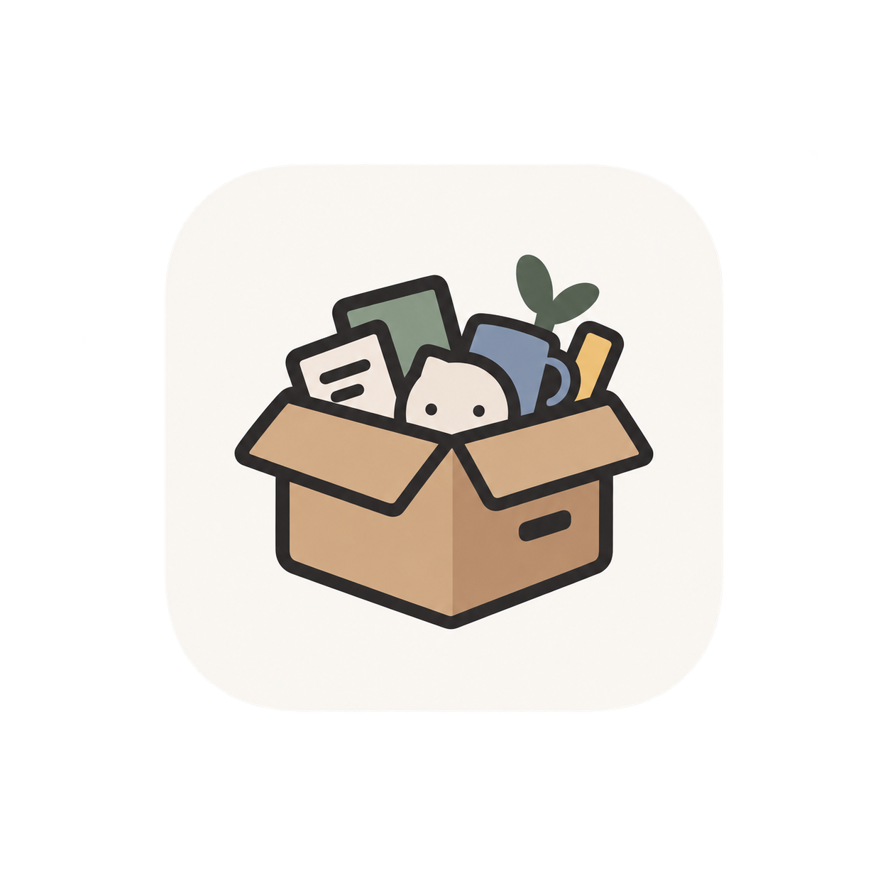

<p align="center"></p>

# Garakuta

[](https://github.com/d0lim/garakuta/actions/workflows/ci.yml)
[](LICENSE)


A menu bar organizer, a notch panel and a window switcher for macOS in one small, local-only app. Swift, no dependencies, no accounts, no telemetry.

## What it does

**Menu bar** — hide icons behind a separator, keep an always-hidden section, reveal them by hover, click, scroll or hotkey, and browse hidden icons in a bar below the menu bar (also under the notch). Icons can be auto-hidden when the menu bar runs out of room, grouped, or spaced out. Works on macOS 26, where every status item is hosted by Control Center and has to be discovered through Accessibility. On macOS 27 the system handles overflow itself and an app can no longer hide icons, so hiding is switched off there; spacers, groups and the ⌘-drag guide remain.

**Notch panel** — an island-style panel on every display: now-playing controls for whatever app is playing (music players, browsers, podcasts, video), with five bars that can move with the music, a timer, battery, and a shelf you can drop files on and share, compress or drag out again later. Hover, click, swipe and drag gestures, per-display appearance, full-screen and Mission Control rules, and it can stay out of screenshots and screen sharing.

**Window switcher** — hold ⌥⇥ to see every window, most recently used first, with live thumbnails that keep each window's shape, including minimized windows and windows on other Spaces. Type to filter with ranked matches, hold ⇥ to keep cycling, close, minimize, hide or quit from the switcher, drop files on a tile to open them there, and preview the selected window at full size. Three styles (thumbnails, app icons, titles), a second shortcut for the active app's windows, per-app rules and a choice of which display it opens on. The shortcut is yours to pick, ⌘⇥ included: with Accessibility permission Garakuta takes it ahead of the system switcher.

A first-launch setup assistant walks through feature bundles, conflicting utilities, permissions and a live tour of each module.

## Shortcuts

Everything here is configurable in Settings; these are the defaults.

| Keys | What they do |
| --- | --- |
| ⌥⇥ | Open the window switcher. ⌥⇧⇥ cycles backwards, and holding ⇥ keeps cycling. |
| ⌥` | Open the switcher on the active app's windows only. Off until you turn it on. |
| ⇥ ⇧⇥ ← → ↑ ↓ | Move the selection while the switcher is open. Typing filters it, ↩ switches, ⎋ cancels. |
| ⌘W ⌘M ⌘F ⌘H ⌘Q | Close the selected window, minimize or restore it, toggle full screen, hide or show its app, quit its app. |
| ⌘-drag | Move a menu bar icon across a section boundary. This is macOS's own gesture and needs no permission. |

## Install

```sh
brew install --cask d0lim/tap/garakuta
```

Then open Garakuta from Applications. The setup assistant walks through permissions on first launch. The app is ad-hoc signed for now; the cask removes the quarantine flag after install so Gatekeeper does not block it. Release archives are also on the [releases page](https://github.com/d0lim/garakuta/releases).

## Status

The 15 features of the original scope are implemented, and releases since have gone on refining them: a switcher that follows use rather than stacking order, now-playing that reads the system's media service directly, and bars that move with the music. Unit tests cover the pure logic; every interaction path that needs Accessibility permission is verified by hand with the [manual test guide](docs/plan/manual-tests.md), so expect rough edges. See the [changelog](CHANGELOG.md) for what each release contains.

## Build from source

Requires macOS 15 or later. Command Line Tools build and bundle the app; running `swift test` needs a full Xcode, which is where XCTest lives.

```sh
swift build
./scripts/bundle.sh        # → build/Garakuta.app, ad-hoc signed
open build/Garakuta.app
```

Then grant Accessibility (and, if you want icon captures and thumbnails, Screen Recording) in System Settings. Quit any other menu bar manager or window switcher first; they compete for the same menu bar and shortcut. Because the bundle is ad-hoc signed, macOS may forget the Accessibility grant after a rebuild; remove and re-add the app in the list.

## Permissions

| Permission | Needed for | Without it |
| --- | --- | --- |
| Accessibility | Listing and moving other apps' menu bar icons, clicking them from the hidden-items bar, window titles, minimized windows, the most-recently-used order, releasing ⌥ to select, taking ⌘⇥ from the system switcher | Sections still hide and reveal; you ⌘-drag icons yourself; the switcher lists windows front to back, cycles with repeated ⌥⇥ and selects with Return |
| Screen Recording | Real icon images and window thumbnails | App icons and titles |
| Automation | Music and Spotify polling when the bundled helper cannot run; browser tab titles on systems older than macOS 15.4 | Browsers show as playing without a title on those systems |
| System audio recording | The now-playing bars moving with the music. Off by default; macOS asks the first time you turn it on | The bars keep their own rhythm |

## Project layout

```
Sources/Garakuta           app shell, settings window, onboarding
Sources/GarakutaCore       settings store, hotkeys, display geometry, event bus, window capture
Sources/MenuBarKit         M01–M05
Sources/NotchKit           N01–N08
Sources/WindowSwitcherKit  W01–W02
Sources/PrivateAPIs        dlsym loaders for SkyLight / HIServices private symbols (C)
Sources/NowPlayingBridge   now-playing helper loaded into the system perl interpreter (C)
Tests                      unit tests for the pure logic (search ranking, tile layout, settings decoding)
docs/plan                  feature list, implementation plan, manual test guide
```

Feature IDs refer to the [feature list](docs/plan/features.md); the architecture and the macOS 26 constraints are in the [implementation plan](docs/plan/implementation-plan.md).

## Contributing

See [CONTRIBUTING.md](CONTRIBUTING.md). Security issues go through [SECURITY.md](SECURITY.md). Prior art and included third-party material are listed in [THIRD_PARTY_NOTICES.md](THIRD_PARTY_NOTICES.md).

## License

[MIT](LICENSE)
